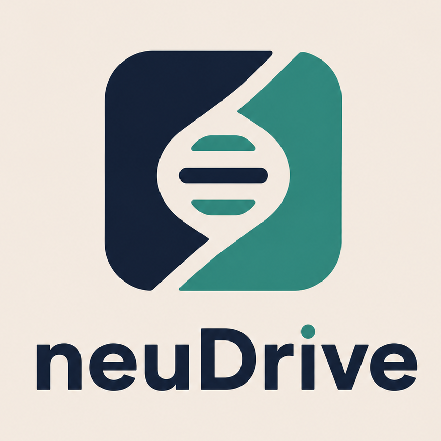
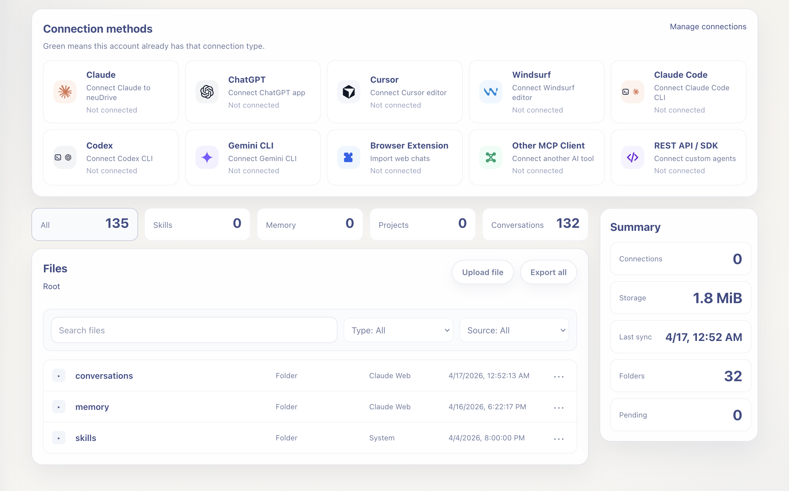

English | [简体中文](README.zh-CN.md)

# neuDrive

<p align="center">
  
</p>

**A personal data hub for AI agents**

> One place for Claude, ChatGPT, Codex, Cursor, and other agents to use your profile, memory, project context, skills, and access rules.

neuDrive gives one person one agent data hub. Claude, ChatGPT, Codex, Cursor, Gemini, Feishu, and other agents can read authorized profile, memory, projects, conversations, skills, and vault material through that hub instead of rebuilding context on every platform.

You can deploy neuDrive yourself and run your own hub. I also host a ready-to-use version at [https://www.neudrive.ai](https://www.neudrive.ai) if you want to try it right away. Use promotion code `VIVO50` for three free months of service; after that, you can keep subscribing, continue with the available hosted plan, or move to your own self-hosted deployment.

```bash
neu browse
```



Your profile, memory, projects, skills, and private material follow the person, not the platform.

## Features

- **Personal data hub for agents**: Keep profile, memory, projects, conversations, skills, and agent communication in one place, so context can follow you across tools.
- **Cross-platform AI connections**: Connect Claude, ChatGPT, Cursor, Windsurf, Codex CLI, Gemini CLI, Feishu, and custom MCP clients through hosted OAuth, Remote MCP, or local adapters.
- **Memory, project, and skill portability**: Import skills, project context, profile/preferences, conversations, and notes from agent tools, then export or restore them through the CLI, API, and Bundle Sync.
- **Team Library phase one**: Small teams can keep shared skills, MCP configuration notes, prompts, and AI playbooks in a team library that participates in backup, search, and MCP access.
- **Secrets and trust controls**: Store secrets in one vault, issue scoped tokens, and control what each agent can access by trust level.
- **Agent collaboration**: Let agents exchange messages, append project logs, and hand off work without making you copy context between tools.
- **Developer-friendly data surfaces**: Use a canonical virtual tree, typed HTTP APIs, MCP tools, file-tree read/write, and `snapshot/changes` sync interfaces.
- **GitHub Backup**: Mirror the visible neuDrive file tree into a private GitHub repository with recoverable version history. [Open guide](docs/github-backup.md)
- **Hosted or self-hosted**: Use the ready hosted service at [neudrive.ai](https://www.neudrive.ai), or deploy your own hub with local or remote storage.

## Current Boundaries

- GitHub Backup mirrors the user-visible file tree. It does not include plaintext secrets and does not replace a Postgres backup.
- WebDAV / S3-compatible backup uploads neuDrive export zip files for off-server recovery packages. Accounts, connections, billing, sessions, and other internal state still depend on database backup.
- Automatic local Skill writes currently support Claude Code and Codex. Cursor and Gemini CLI are assignable, previewable, and exportable, but neuDrive does not edit their local configuration automatically.
- Claude / Codex Skill conversion preserves scripts, dependency files, assets, and included external references. MCP, plugin, and hook setup is reported for manual review.
- Hosted OAuth, ChatGPT Apps, Claude Connectors, and similar platform features depend on each platform's account plan, rollout, and current rules.
- Team Library is for small-team shared material in this release candidate. It is not an enterprise org-management, audit, SSO, or approval-workflow product yet.

Hosted service examples in this repo use:

- Hub URL: `https://www.neudrive.ai`
- MCP URL: `https://www.neudrive.ai/mcp`

## Start Here

Choose the first path that matches how you want to connect:

1. **Web / Desktop Apps**: fastest path for Claude, ChatGPT, Cursor, and Windsurf through hosted neuDrive with browser auth. [Open guide](docs/setup.md#web-and-desktop-apps)
2. **CLI Apps**: Claude Code, Codex CLI, Gemini CLI, and Cursor Agent with remote HTTP MCP + OAuth. [Open guide](docs/setup.md#cli-apps)
3. **Local Mode**: repo-first local development, LAN setups, or any environment without a public HTTPS URL yet. [Open guide](docs/setup.md#local-mode)
4. **Advanced Mode / GPT Actions / Adapters**: generic HTTP MCP clients, custom GPTs, and webhook-style integrations such as Feishu. [Open guide](docs/setup.md#advanced-mode)

## Web and Desktop Apps

Use this when the connection starts from a graphical interface such as Claude web, ChatGPT, Cursor, or Windsurf.

### Claude Connectors

1. Sign in to the Claude web app and open `Settings -> Connectors -> Go to Customize`.
2. Click `Add custom connector`.
3. Set `Remote MCP Server URL` to `https://www.neudrive.ai/mcp`.
4. Save and click `Connect`.
5. Your browser will open the neuDrive sign-in and authorization flow; after approval, return to Claude.

### ChatGPT Apps

1. Sign in to ChatGPT and open `Settings -> Apps`.
2. In `Advanced settings`, click `Create app`.
3. Set `MCP Server URL` to `https://www.neudrive.ai/mcp`.
4. Follow the prompts to finish neuDrive sign-in and authorization.

If you do not see the `Apps` entry yet, your plan or rollout cohort probably does not have access to it yet.

After the connection is authorized, start a **new chat** and give it a direct import instruction such as:

- `Please import my skills, projects, and profile into neuDrive.`
- `Please read my neuDrive profile, skills, and recent project context, then summarize what is already there.`

For Cursor, Windsurf, and the full setup variants, see [Web / Desktop Apps](docs/setup.md#web-and-desktop-apps).

## Local CLI Quick Start

Install the CLI locally:

```bash
git clone https://github.com/agi-bar/neudrive.git
cd neudrive
./tools/install-neudrive.sh
```

After install, use `neu`; the `neudrive` compatibility alias still works.

```bash
neu status         # check daemon, storage, and current target readiness
neu platform ls    # list installed adapters and connection state
neu connect claude # install/configure the Claude integration
neu browse         # open the local Hub in your browser
```

Then open a **new chat** in the connected client and say something like `Please import this workspace's useful skills, project context, and profile/preferences into neuDrive.`

Detailed CLI usage: [CLI Guide](docs/cli.md)

## Development, Tests, And Builds

Common local development commands:

```bash
cp neudrive.env.example neudrive.env
set -a; source neudrive.env; set +a
go run ./cmd/neudrive server --listen :8080
cd web && npm run dev
```

The frontend dev server runs at `http://localhost:3000` and proxies API requests to `http://localhost:8080`.

For release candidate checks, run at least:

```bash
go test ./...
cd web && npm run build
make build
```

`make build` rebuilds the embedded frontend and produces `bin/neudrive` and `bin/neu`. Deployment readiness checklist: [Release Readiness](docs/release-readiness.zh-CN.md)

## Login To Hosted Cloud

Use the default login when you want the hosted cloud for CLI work, hosted dashboard access, or cross-app sync flows.

```bash
neu login
```

This opens a browser login flow, saves the hosted profile locally, and switches the current target to it.

## Documentation

Start here:

- [Setup Guide](docs/setup.md)
- [GitHub Backup Guide](docs/github-backup.md)
- [Small-scope launch test checklist](docs/launch-test-checklist.zh-CN.md)
- [CLI Guide](docs/cli.md)
- [Reference](docs/reference.md)

Chinese docs:

- [Chinese README](README.zh-CN.md)
- [Chinese Setup Guide](docs/setup.zh-CN.md)
- [Chinese GitHub Backup Guide](docs/github-backup.zh-CN.md)
- [Chinese CLI Guide](docs/cli.zh-CN.md)
- [Chinese Reference](docs/reference.zh-CN.md)

More docs:

- [Token Management](docs/setup.md#token-management)
- [Bundle Sync guide](docs/sync.md)
- [SDK / HTTP API](docs/reference.md#sdk)
- [Product design document](docs/design.md)
- [Prod-like acceptance runbook](docs/sync-prodlike-acceptance.md)
- [Security and resource audit](docs/sync-audit.md)
- [CLI test matrix](docs/cli-test-matrix.md)
