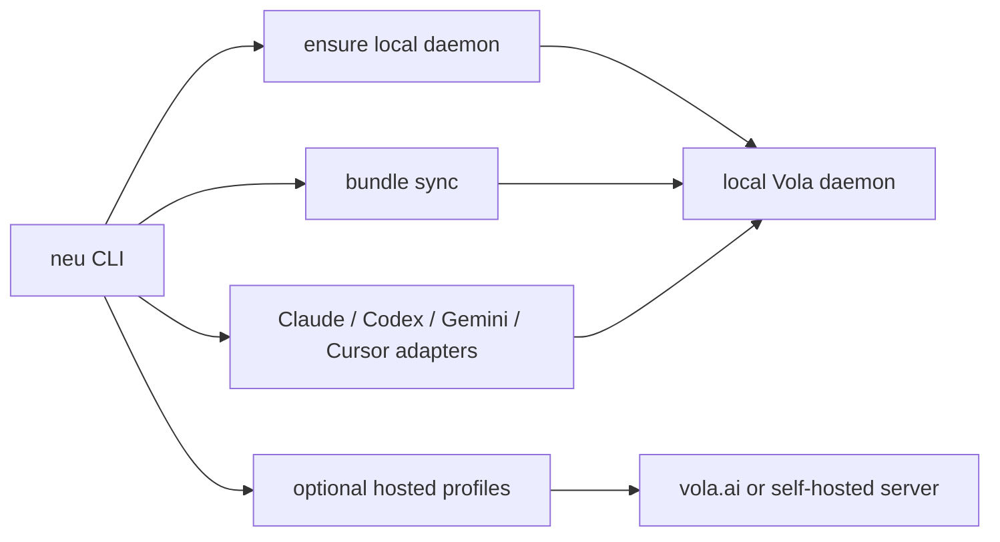

# Vola：跨环境 Agent 中枢系统设计文档

> 版本：v0.5
> 日期：2026-04-04
> 状态：Foundation V1 已落地，文档按当前代码状态更新

---

## 当前产品面：本地优先 + 可选远端服务

从产品表面上，Vola 现在收口成两层：

1. **`neu` 官方 CLI**
   - 默认是本地优先工具
   - 自动托管本地 Hub daemon
   - 管理本地 agent 平台接入、bundle sync、daemon 状态和 local / hosted targets
2. **Vola Server**
   - 可以是官方服务 `https://www.vola.ai`
   - 也可以是用户自己启动的 `neu server`

当前推荐心智：

- 日常用户先装 `neu`
- `neu connect <platform>` 把本地 Claude/Codex/Gemini/Cursor 连到本地 Hub
- `neu import <platform>` / `neu export <platform>` 处理平台数据，其中 Codex 和 Claude 默认优先走 agent-mediated 导入
- `neu sync ...` 处理 bundle 迁移、备份、恢复
- 需要云端工作区时，用 `neu login`

### 平台接入的三层模型

Vola 平台接入现在固定分三层：

1. **MCP 层**
   - 提供 Vola 的全量能力面
   - 包括 tree/files、skills、profile/memory、projects、sync token 等现有工具
2. **入口层**
   - 平台原生入口统一命名为 `vola`
   - Claude Code：`/vola <subcommand>`
   - Codex：`$vola <subcommand>` 或 `/skills` 选择 `vola`
3. **技能层**
   - 系统级 umbrella skill：`/skills/vola/SKILL.md`
   - 平台本地安装物只是入口和步骤说明，不复制 MCP 功能

这意味着：**MCP 是完整能力面，`vola` skill / command 是平台内入口面。**

### 运行时模型



### 当前实现状态

- `neu server`
  作为统一服务端入口，取代官方文档里的 `cmd/server` 直接用法
- `neu mcp stdio`
  作为高级兼容模式保留，不再是主路径
- `neu sync ...`
  已并入统一 CLI 表面
- `neu platform ls/show/connect/disconnect/import/export`
  已提供首批本地 CLI 平台适配器：`claude-code`、`codex`、`gemini-cli`、`cursor-agent`
- 本地 daemon 默认使用 SQLite
  本地首次启动会自动 bootstrap local owner 和本地数据库路径
- 远端 / 官方服务模式继续以 Postgres 为主

### 当前限制

SQLite 本地优先主链路已经接进来了，但仍有两个明确边界：

- GitHub OAuth / 对外 OAuth provider / 依赖公网回调的链路，在本地 SQLite 模式下显式禁用并提示切换到远端/公网服务模式

这意味着：本地日常使用、平台接入、bundle sync、本地 daemon 自动托管已经可用；而公网 OAuth 型能力仍然属于远端/官方服务模式。

---

## 零、战略定位：这件事在历史坐标里的位置

### 0.1 每一次计算范式转移，都会产生一个信任层

回看过去 25 年，每次计算范式的切换，都有一个"信任中间层"从无到有，最终成为基础设施：

| 时代 | 信任层 | 做了什么 | 为什么赢 |
|------|--------|---------|---------|
| PC 互联网 | 谷歌登录 / Facebook Login | 统一身份，一键登录所有网站 | Gmail/Facebook 已经有用户基数，网站接入成本极低 |
| 移动互联网 | Apple ID / Google Play | 身份 + 支付 + 应用分发 | 绑定硬件，用户无法绑过 |
| 电商/支付 | 支付宝 / Stripe | 信任担保 + 资金托管 | 解决了陌生人之间"你先发货还是我先付款"的信任问题 |
| 云计算 | AWS IAM | 身份 + 权限 + 资源访问控制 | 开发者已经在 AWS 上跑服务，IAM 是自然延伸 |
| 自动化 | IFTTT / Zapier | 跨服务的触发器和动作编排 | 极客市场验证了需求，但从未突破到大众 |

现在进入 AI Agent 时代，这个信任层还不存在。每个 AI 平台都在做自己的连接器（MCP、GPT Actions、飞书 Agent 等），但这些都是**向心的**——让用户更深地绑定在自己的平台上。没有人在做**离心的**信任层——让用户的身份、数据、能力独立于任何平台

这就是 Vola 要占据的生态位：**AI 时代的统一信任层**

### 0.2 为什么 IFTTT 没有成为这个东西

IFTTT 验证了跨服务编排的需求，但它停在了极客玩具的位置，从来没有成为"基础设施"。原因有三个，对 Vola 的设计有直接启示：

**第一，IFTTT 需要用户主动配置规则。** "如果 Gmail 收到带附件的邮件，就保存到 Dropbox"——这需要用户想清楚自己要什么、用技术语言表达出来、然后维护这些规则。大众用户做不到也不愿意做

Vola 的区别：用户不配置规则。用户用自然语言说话（"帮我把这个文件存到 NAS 上"），Agent 通过 Hub 发现有 NAS 可用、知道怎么调用、自动完成。规则是 Agent 实时推断的，不是用户预设的

**第二，IFTTT 没有身份和信任。** 它只做动作触发，不管"你是谁"和"你信任谁"。用户的身份信息、隐私数据、支付凭证，IFTTT 都不碰

Vola 的区别：身份和信任是核心。Hub 的第一价值不是"帮你连接服务"，是"任何 Agent 通过 Hub 立刻知道你是谁、你信任它到什么程度、它能做什么"。这是"谷歌登录"级别的能力，不是"Zapier"级别的

**第三，IFTTT 的网络效应不够强。** 我不用 IFTTT，不影响你用 IFTTT。没有跨用户的价值

Vola 的区别：当两个用户都有 Hub，他们的 Agent 可以直接通信、共享知识、协同工作。用户越多，每个用户的 Agent 能做的事越多。这是真正的网络效应

### 0.3 Vola 要成为什么

一句话：**AI 时代的身份与信任基础设施**

它不是一个 App，不是一个工具，不是一个 SaaS 产品。它是一层协议 + 一个服务，所有 AI Agent 的交互都经过这一层。就像所有网站的登录都可以经过谷歌登录，所有 Agent 的身份验证、上下文获取、权限管理、跨平台通信都经过 Vola

长期看，用户看到的应该是这样的东西：

- 在任何 AI 平台的界面上，有一个 **"Connect with Vola"** 的按钮（类比"Sign in with Google"）
- 点一下，这个 AI 平台立刻知道你是谁、你的偏好、你有哪些工具和设备、你信任它到什么程度
- 你在这个平台上做的事情，自动同步到你的 Hub，下次在别的平台继续
- 你让 Agent 付款、签署文件、访问敏感数据，Hub 提供安全的鉴权和托管

### 0.4 它的生态位到底有多大

把 Vola 要覆盖的能力拆开看：

| 能力 | 类比 | 说明 |
|------|------|------|
| 统一身份 | Google Login | 一个 ID，所有 Agent 平台通用 |
| 安全凭证存储 | Apple Keychain / 1Password | 密码、token、身份证号、银行卡，加密存储，按需调用 |
| 上下文同步 | iCloud | 偏好、记忆、工作历史跨平台同步 |
| 支付鉴权 | Apple Pay / 支付宝 | Agent 代用户付款时的信任担保 |
| 跨服务编排 | IFTTT / Zapier（升级版） | 但不需要用户配置规则，Agent 自动推断 |
| Agent 间通信 | 电子邮件 | 结构化消息，自包含上下文，可搜索存档 |
| 设备控制 | HomeKit / Google Home | AI 原生的统一设备入口 |

每一个单独拿出来都是一个大市场。它们汇聚在一起，是因为 Agent 时代这些需求是同时出现、互相依赖的：没有身份就没有信任，没有信任就不能存储秘密，没有秘密就不能调用支付，没有支付 Agent 就不能帮你办事……

### 0.5 鸡生蛋问题：怎么冷启动

"谷歌登录"之所以能推开，是因为 Gmail 已经有几亿用户。Apple ID 之所以能推开，是因为 iPhone 已经卖了几亿台。信任层不能凭空推广，需要一个木马产品把用户带进来

Vola 可能的冷启动路径（需要进一步验证，列出几个方向）：

**路径 A：MCP 生态切入**。Claude 已经原生支持 MCP，用户可以直接连接 MCP server。Vola 做成一个 MCP server，任何 Claude 用户一行配置就能接入。先在 Claude 生态里获得种子用户，再扩展到其他平台。这是最低成本的起步方式

**路径 B：平台原生接入**。优先利用 Claude Connectors、ChatGPT Apps、Cursor / Windsurf Remote MCP 等官方或稳定接口，让用户在现有 AI 工具里授权 Vola，而不是依赖页面结构

**路径 C：社区驱动**。从 AGI Bar 社区和中国 AI 从业者圈子开始，先服务最有影响力的早期用户。这些人每天在多个 AI 平台之间切换，痛点最强烈。他们用起来之后，自然会推荐给自己的圈子

**路径 D：开发者 SDK**。给 Agent 应用开发者提供 SDK："在你的 Agent 应用里加两行代码，你的用户就可以用 Vola 登录，自动获得用户的偏好和上下文"。这是"谷歌登录"的复制路径，但需要开发者生态的配合

这几条路径不互斥。当前最可行的是 A + C：先做 MCP server，在 AGI Bar 社区的 power user 里跑通，积累口碑，然后扩展

---

## 一、产品定义

一句话：**Agent 的路由器 + 保险柜 + 外置大脑 + 邮局**

用户每天在不同平台使用 AI Agent（Claude、GPT、飞书、智谱、MiniMax……），但这些 Agent 彼此不通，每个 session 都是全新的。用户被迫反复给 Agent 补上下文、手动搬运个人信息、在明文环境里粘贴 API key 和身份证号。同时，Agent 之间无法协作——用户必须手动当传话筒，把一个 Agent 的产出搬给另一个

Vola 是一个独立的中间层服务，解决四件事：

1. **上下文漫游**：用户的偏好、记忆、工作历史在所有 Agent 平台间同步
2. **秘密管理**：敏感信息加密存储，按信任等级自动注入，永远不出现在对话明文里
3. **能力路由**：所有 .skill、设备、服务统一注册，任何 Agent 进来都能发现和调用
4. **Agent 通信**：Agent 之间可以发邮件、传递上下文、协同完成任务，通信记录本身也是持久记忆的一部分

用户日常不会打开 Hub 的界面。他们在 Claude、GPT、飞书里正常说话，Hub 在背后默默运行。只在初始配置和偶尔的冲突处理时才需要进入管理后台

---

## 二、为什么现在是窗口期

### 2.1 环境现状

**Agent 使用已经分裂成孤岛**。一个典型用户的一天：上午用 Claude 写文章，下午用 GPT 翻译文档，晚上用飞书 Agent 整理日程，偶尔用智谱或 MiniMax 的 Agent 做特定任务。每个平台都在做自己的记忆系统（Claude 有 memory、GPT 有 memory、飞书有上下文），但互不相通

**敏感信息管理是裸奔状态**。用户的 API key、身份证号、银行卡信息、各平台授权 token 被迫存在 .skill 文件的明文里，或者每次手动粘贴到对话框。一个字打错就会出问题，更不用说安全隐患

**设备和服务没有统一入口**。用户家里的智能灯、NAS、打印机，工作中的飞书、企业微信、GitHub，每个都需要单独配置。Agent 不知道用户有什么设备和服务可用

### 2.2 市场时机

- 所有主流 AI 平台都在推 MCP（Model Context Protocol）或类似的连接器协议，说明行业认可了 Agent 需要连接外部服务
- 但没有人做"用户侧的统一中间层"——平台做的连接器都是为自己服务的
- .skill 文件格式已经在 Claude 生态里跑通了，证明了"文件即能力"的模式可行
- 智能家居、IoT 设备保有量足够大，但缺少 AI 原生的统一控制层

### 2.3 为什么不是各平台自己做

各平台做的记忆和连接器是**向心的**——让用户更依赖自己的平台。Hub 做的是**离心的**——让用户的数据和能力独立于任何平台。这两件事的立场根本不同，不会有平台愿意做后者

---

## 三、核心设计原则

### 3.1 一切皆 .skill

整个系统的最小可寻址单元是 .skill。设备是 skill，能力是 skill，甚至一段持久记忆本质上也可以表达为 skill 的一部分。理由：任何 Agent 不管来自哪个平台，都擅长做一件事——读文件，然后按照文件里的指示行动。不需要学新协议

### 3.6 当前产品收口说明（2026-04-08）

下面这些方向暂时只保留在设计层，不属于当前对外开放的产品能力：

- `devices`
- `roles`
- `inbox`
- `collaboration`

当前决策是：

- Dashboard 和数据文件导航里先隐藏这些入口
- 公共文件树、MCP、GPT Actions、token 预设、system skill 文案里都不再把它们当成当前可用能力
- Agent 当前只暴露 `profile / memory / projects / skills / tree / token / sync` 这一组稳定能力

这些方向后续会在需求、权限模型和产品边界想清楚后再重新开放；在那之前，它们都按待办设计处理，而不是可承诺功能。

文档中后续如果还出现 `devices / roles / inbox / collaboration` 的架构设想、权限草图或流程举例，都应理解为设计预研或历史草稿，不代表当前版本已经开放。

### 3.2 路由器思维

用户不打开 Hub 的界面，就像不打开路由器管理页面。配置一次，然后 Hub 自动工作。日常交互全部发生在用户已经在用的 App 里

### 3.3 苹果式权限

权限不是弹窗，是预配置的信任等级。类比苹果：不是每次打开相机都问你"允许使用摄像头吗？"，是你安装 app 时授权一次。Hub 的权限在管理后台配好，运行时静默执行

### 3.4 Harness 式分层

系统设计采用 Harness Engineering 的分层思想：核心层尽量小、约束层解释 why 不只是 what、验证层可机械化执行、反馈层让系统自成长。不把事情写死，留足演化空间

---

## 四、用户故事

### 4.1 用户画像

**画像 A：De 本人（Power User，技术背景）**
- 每天在 Claude、GPT、飞书之间切换
- 有大量 .skill 文件需要跨平台使用
- 需要让 Agent 访问飞书日历、公众号后台、GitHub 等服务
- 有时让自己的 Agent 帮朋友干特定任务
- 家里有智能设备需要统一控制

**画像 B：AI 从业者/VC（中度用户，非技术背景）**
- 主要用 Claude 和 GPT 做研究、写报告
- 有一些个人偏好（写作风格、格式要求）需要跨平台保持
- 需要管理多个平台的 API key 和授权
- 不愿意也不会手动编辑配置文件

**画像 C：普通用户（轻度用户，零技术背景）**
- 把 AI 当搜索引擎和写作助手用
- 最大痛点是每次都要重复告诉 AI "我是谁、我喜欢什么"
- 家里有智能设备，希望用自然语言控制
- 完全的苹果用户心态：不应该看到任何技术细节

### 4.2 核心用户故事

**故事 1：跨平台上下文保持**

> 我上午在 Claude 里写了一篇公众号文章，Claude 知道我的写作风格（不用句号结尾、不用比喻、标题信息密度高）。下午我切到 GPT 想继续修改这篇文章的某个段落，GPT 应该立刻知道我的写作风格，并且知道上午写了什么

当前痛点：GPT 完全不知道上午发生了什么，用户需要重新描述写作风格、粘贴文章内容

Hub 解法：Claude 和 GPT 都通过 Hub 读取同一份 profile（写作偏好）和 project log（上午的写作记录）。用户什么都不用做

**故事 2：安全的敏感信息调用**

> 我让 Agent 帮我订机票，Agent 需要我的身份证号和常用邮箱。我不想每次都手动粘贴，更不想把身份证号存在对话记录里

当前痛点：用户把身份证号粘贴到对话框，或者存在 .skill 文件的明文里

Hub 解法：身份证号存在 Hub 的加密 vault 里。Agent 通过 Hub API 请求，Hub 检查该 Agent 的信任等级是否允许读取该 scope 的信息，允许则返回。对话记录里只会出现"已从安全存储中获取身份信息"，不会出现实际内容

**故事 3：设备控制**

> 我躺在沙发上对手机里的 Claude 说"把客厅灯调暗一点，空调调到 26 度"

当前痛点：需要打开不同的 App（米家、Home Assistant、各品牌自己的 App）

Hub 解法：每个设备在 Hub 里注册为一个 .skill，包含品牌、协议、API 端点、能做什么。Agent 读目录发现有哪些设备，读 SKILL.md 知道怎么控制，通过 Hub 的 adapter 发出调用

**故事 4：有限权限的代理任务**

> 我让我的一个 Agent 帮朋友处理 ClawColony 项目里的一个开发任务。这个 Agent 应该能访问 ClawColony 的项目资料，但绝对不能看到我的个人信息、银行卡、其他项目的任何内容

当前痛点：无法做到。要么给 Agent 全部权限，要么手动挑选信息发给它

Hub 解法：在管理后台创建一个"协作"级别的连接，限定只能访问特定项目。Agent 看到的文件树只有那个项目文件夹，其他一切不存在

**故事 5：新 Agent 环境的冷启动**

> 我今天第一次试用一个新的 AI 平台（比如 Grok 或某个垂直领域的 Agent），我希望它第一次见我就知道我是谁、我的习惯、我有哪些工具可用

当前痛点：每个新平台都是从零开始

Hub 解法：新平台通过 Hub 的 adapter 连入，立刻可以读取 profile（在信任等级允许的范围内）。第一句话就能叫出你的名字，知道你的偏好

**故事 6：Agent 间的消息传递与异步协作**

> 我让 Agent A 去做一个调研任务（异步的，可能要跑很久），做完之后把结果发给 Agent B，Agent B 根据调研结果帮我写一份报告

当前痛点：完全不可能。用户必须等 Agent A 做完，手动把结果复制给 Agent B

Hub 解法：Agent A 完成后把结果写入项目的 context log，并给 Agent B 的收件箱发一条消息。消息里包含完整上下文（自包含，收件方不需要前置信息就能理解和行动）。Agent B 被唤醒后读取消息和上下文，开始工作

**故事 7：跨 Agent 知识融合**

> 我有一个专门做海淀政策研究的 Agent（积累了大量政策解读经验），还有一个擅长写公众号的 Agent（熟悉我的写作风格）。我想让它们合作：政策研究 Agent 提供素材和判断，写作 Agent 用我的风格把它变成文章

当前痛点：两个 Agent 各自有各自的 skill 和经验积累，但无法共享。用户只能手动做中间人：从 A 那里拿到分析结果，再喂给 B

Hub 解法：用户在管理后台创建一个协作项目，两个 Agent 都能访问这个项目的文件夹。政策 Agent 把分析结果写入 `context.md`，写作 Agent 读取后按自己的 skill 加工。两个 Agent 通过项目文件夹做"无声协作"——它们不需要实时对话，只需要读写同一个共享空间。如果需要主动通知，发一封邮件就行

关键点：每个 Agent 只带着自己被授权的 skill 和记忆参与协作。政策 Agent 不会看到写作 Agent 的风格指南，写作 Agent 也不会看到政策 Agent 的检索策略。它们共享的是项目上下文，不是彼此的能力

**故事 8：把我的知识借给别人的 Agent**

> 朋友在做一个 AI 教育项目，想用到我在 AGI Bar 积累的行业洞察。但我不想把整个知识库给他，只想把跟教育相关的部分共享出去。他的 Agent 应该能读到这些内容，结合他自己的素材一起工作

当前痛点：用户必须手动挑选内容、导出、发给朋友、朋友再手动喂给自己的 Agent

Hub 解法：在管理后台创建一个"协作"连接，绑定朋友的 Hub ID，限定可访问的范围（比如只能读 `/projects/industry-insights/` 下标记为 `education` 的内容）。朋友的 Agent 连入后，除了能读自己主人 Hub 里的全部内容，还能读到我共享出去的那一小块。两边的知识在朋友的 Agent 里汇合

**故事 9：通信记录即记忆**

> 上个月我的 Agent A 给 Agent B 发过一封关于"Q2 预算调整"的邮件，里面有完整的分析和结论。一个月后我在一个全新的 session 里问"Q2 预算当时怎么调的"，Agent 应该能找到那封邮件里的信息

当前痛点：对话记录在各平台里，跨平台不可检索。更不用说 Agent 之间的通信（根本不存在）

Hub 解法：邮件本身就是记忆的一种形态。所有通过 Hub 发送的邮件都自动进入可搜索的存档。当 Agent 搜索记忆时，搜索范围不仅包括 memory/ 目录下的文件，也包括 inbox/ 里的历史邮件。邮件的结构化元数据（时间、主题、参与者、标签）让检索精准度比全文搜索高得多

---

## 五、系统架构

### 5.1 文件树结构（核心数据模型）

```
/
├── identity/
│   └── profile.json            ← 非敏感的基本信息：名字、时区、语言偏好
│
├── memory/
│   ├── profile/
│   │   ├── preferences.md
│   │   ├── relationships.md
│   │   └── principles.md
│   └── scratch/
│       └── {date}/
│           └── {slug}.md       ← append-only 短期记忆条目
│
├── projects/
│   └── {project-name}/
│       ├── context.md          ← 项目简报，人可读
│       └── log.jsonl           ← 结构化事件日志，append-only
│
├── skills/
│   └── {skill}/
│       ├── SKILL.md
│       └── ...                 ← 附属文件
│
├── devices/
│   └── {device}/
│       ├── SKILL.md
│       └── config.json
│
├── roles/
│   └── {role}/
│       └── SKILL.md
│
└── inbox/
    └── {role}/
        ├── incoming/
        │   └── {message-id}.json
        ├── read/
        │   └── {message-id}.json
        └── archived/
            └── {message-id}.json
```

说明：

- 这棵树是 canonical logical tree，不一定要映射到文件系统的物理路径。当前实现用 PostgreSQL 持久化 entry，并把 project / memory / inbox / skills 等 typed API 收敛到同一核心上
- 用户身份维度由认证上下文决定，不再体现在路径前缀里；也就是说对外路径以 `/projects/...`、`/memory/...` 这样的 canonical path 为准，而不是 `/{user-id}/...`
- `vault` 的真实 secret 值当前**不作为普通树文件暴露**。secret 仍走 typed vault API 和加密存储；导出与搜索只暴露 scope metadata，不暴露密文或明文值
- `SKILL.md` 会在服务端解析 frontmatter，并索引 `name`、`description`、`when_to_use`、`allowed_tools`、`tags`、`arguments`、`activation`、`min_trust_level`
- Agent 进来后先读根目录，发现有什么可用，然后按需深入。跟现在 Claude 读 `/mnt/skills/` 的逻辑完全一致
- 每个目录的 SKILL.md 既是给 Agent 读的操作指南，也是给人读的文档

### 5.2 信任等级体系

四档，用户在管理后台为每个连接选一档即可：

| 等级 | 名称 | 可见范围 | 典型场景 |
|------|------|---------|---------|
| L4 | 完全信任 | 全部，包括 vault 全部 scope | 用户的主力 AI 助手（如 Claude） |
| L3 | 工作信任 | skills、memory、devices，vault 中非个人敏感信息 | 日常使用的其他 AI 平台 |
| L2 | 协作 | 仅被明确共享的特定项目 | 帮朋友干活、跨组织合作 |
| L1 | 访客 | 仅公开 profile（名字、时区） | 第三方 Agent、陌生人 |

信任等级决定 Agent 看到的文件树切面。低等级的 Agent 不只看不到不该读的 tree subtree，也拿不到对应的 vault scope 视图

**预定义的等级 → scope 映射**（用户不需要理解，这是系统内部逻辑）：

```
L4 完全信任:
  identity/         ✅ 全部
  vault/            ✅ 全部 scope
  skills/           ✅ 全部
  devices/          ✅ 全部
  memory/           ✅ 全部
  roles/            ✅ 可创建新角色
  inbox/            ✅ 全部

L3 工作信任:
  identity/         ✅ profile.json（非敏感）
  vault/            🔒 仅 auth.* scope（各平台授权 token）
  skills/           ✅ 全部
  devices/          ✅ 全部
  memory/
    profile/        ✅ 全部
    projects/       ✅ 全部
    scratch/        ✅ 全部
  roles/            ❌
  inbox/            🔒 仅自己角色的

L2 协作:
  identity/         🔒 仅名字
  vault/            ❌
  skills/           🔒 仅项目关联的
  devices/          ❌
  memory/
    profile/        🔒 仅 preferences.md
    projects/       🔒 仅被共享的项目
    scratch/        ❌
  roles/            ❌
  inbox/            🔒 仅项目相关

L1 访客:
  identity/         🔒 仅名字、时区
  其他全部           ❌
```

**用户在管理后台看到的**不是上面这张表，是一个极其简单的选择：

```
Claude    [完全信任 ▼]
GPT       [工作信任 ▼]
飞书       [工作信任 ▼]
朋友 A    [协作 ▼]     → 共享项目: [选择...]
```

### 5.3 记忆系统设计

记忆分三层，每层的写入方式和生命周期不同：

**Profile 层（人工维护 + 确认式更新）**

- 内容：写作风格偏好、沟通习惯、做事原则、常用联系人
- 写入方式：用户在管理后台手动填写，或从 Claude memory 等平台导入后人工确认
- 更新频率：极低，可能几个月改一次
- 冲突处理：如果不同平台的 Agent 捕获了矛盾的偏好（Claude 里说"不用句号"，GPT 里说"正式文档用句号"），两条都保留，在管理后台标记冲突，等用户决定
- 所有信任等级（L2 以上）都可以读这层的部分或全部内容

**Projects 层（自动积累 + 结构化）**

- 内容：每个项目一个文件夹。context.md 是人可读的项目简报（背景、当前状态、关键决策），log.jsonl 是结构化的事件日志
- 写入方式：Agent 每次完成一个有意义的动作后，自动往 log.jsonl append 一条记录。context.md 由系统定期从 log 生成摘要，或由用户手动编辑
- 更新频率：每次 Agent 交互都可能写入
- 生命周期：项目可以被归档，归档后 Agent 不再自动访问但不删除
- log.jsonl 的单条记录格式：

```json
{
  "timestamp": "2026-03-31T14:23:00Z",
  "source": "claude",
  "role": "assistant",
  "action": "wrote_article",
  "summary": "帮用户写了一篇关于海淀算力券的公众号文章，标题《算力券到底补贴了谁》",
  "artifacts": ["article-draft-v1.md"],
  "tags": ["writing", "haidian", "policy"]
}
```

**Scratch 层（全自动，自动衰减）**

- 内容：每天一个目录、每条记忆一个文件，记录当天重要的 Agent 交互片段
- 写入方式：自动写入为主，也允许通过 HTTP / MCP 主动保存短期记忆
- 生命周期：当前实现默认保留 7 天，到期后清理；如果其中有重要信息，应该已经被沉淀到 project 层
- 用途：解决"今天上午我让 GPT 做了个什么来着"的问题

### 5.4 连接架构

```
Claude ─── MCP ──────┐
                     │
GPT ─── HTTP API ──┐ │
                   │ │
飞书 ── HTTP API ──┤ ├──→  Hub Server
                   │ │     ├── Auth Layer（验证身份、确定信任等级）
MiniMax ───────────┘ │     ├── Router（根据信任等级裁剪可见的文件树）
                     │     ├── Storage（文件树的实际存储）
智谱 ────────────────┘     ├── Adapter（设备和服务的调用代理）
                           └── Mail Router（Agent 间通信 + 内容审查 + 存档）
```

Hub 对外暴露的核心 API 语义是一组围绕 virtual tree 的操作，再叠加 typed capability：

| 操作 | 语义 | 说明 |
|------|------|------|
| `list(path)` | 列出目录内容 | 返回结果已按信任等级过滤 |
| `read(path)` | 读取文件内容 | 读取的是 canonical tree 中的 live entry |
| `write(path, content, options)` | 写入文件 | 支持 `min_trust_level`、`expected_version`、`expected_checksum` 等 optimistic write 选项 |
| `delete(path)` | 删除文件 | 生成 tombstone，而不是静默硬删除 |
| `snapshot(path)` | 获取子树快照 | 返回 `entries + cursor + root_checksum`，用于冷启动同步 |
| `changes(cursor, path)` | 获取增量变更 | 基于 cursor 回放 create / update / delete 事件流 |
| `search(query, scope)` | 全文搜索 | 搜索范围覆盖 memory + projects + inbox + skill metadata，受信任等级限制 |
| `call(device, action, params)` | 设备调用 | 通过 adapter 转发到具体设备 |
| `send(from, to, message)` | 发送邮件 | Hub 审查内容是否超出信任等级边界 |
| `receive(role, filters)` | 接收邮件 | 按角色收取，支持按 domain/tag/priority 过滤 |

MCP 是首选协议（Claude 原生支持），HTTP API 做 fallback（所有平台都能用）。两者操作的是同一棵 virtual tree，只是传输层不同

### 5.5 角色与 Agent 身份

Agent 的身份是三元组：`{user-id} / {role} / {scope}`

角色本身也是一个 .skill 目录，SKILL.md 里定义了：
- 这个角色能看到哪些文件路径
- 能使用哪些 vault scope
- 生命周期（session 级 / 项目级 / 永久）
- 汇报对象（如果是 sub-agent 或 delegate）

通信地址从三元组生成：`worker:agi-bar-funding@de.hub`

角色的创建方式：
- **assistant** 角色：系统默认创建，每个用户都有
- **worker-{project}** 角色：用户创建新项目时自动创建
- **delegate-{task}** 角色：用户在管理后台手动创建，或通过 assistant 角色口头指示创建（"给朋友 A 开一个协作权限，只看 ClawColony 项目"）

### 5.6 Agent 通信系统

Agent 间的通信不是一个附加功能，它同时在做三件事：**消息传递**、**协作协调**、**记忆沉淀**。一封邮件发出去的那一刻，它既是通知，也是将来可以检索的历史记录

#### 5.6.1 消息结构

沿用之前设计的三层结构（信封 → 元数据 → 内容），从轻到重、按需读取：

```
Envelope（信封）→ 路由用，总是处理
  from:         assistant@de.hub
  to:           worker:policy-research@de.hub
  thread_id:    项目或任务的关联线索
  sent_at:      发送时间
  ttl:          过期时间（过期自动归档，不删除）
  priority:     normal | urgent
  action_required: true | false

Metadata（元数据）→ 不读正文就能决策
  domain:       governance | kb | collab | tools | outreach
  action_type:  task_request | info | result | alert | handoff
  tags:         [自定义标签，用于过滤和检索]
  context_hash: 发送时环境状态的哈希（收件方可检测消息是否过时）

Content（内容）→ 有效载荷
  subject:      人可读的主题
  body:         正文，自包含（收件方可能没有任何前置信息）
  structured_payload: 机器可解析的结构化数据（JSON）
  attachments:  附件引用（指向文件树里的路径）
```

关键原则：**每条消息自包含**。收件方可能是一个全新的 Agent 实例，没有任何前置记忆。消息体里必须包含足够的上下文让它直接行动。这跟人类邮件不同——人类可以说"接着昨天的讨论"，Agent 不行

#### 5.6.2 三种通信模式

**模式一：同用户内的 Agent 协作**

用户自己的多个 Agent 之间通信。最常见的场景：

```
用户说："帮我调研一下海淀算力券政策，然后写成一篇公众号文章"

Hub 拆分为两个任务：

  Agent A（角色: worker:policy-research）
    → 带着 haidian-knowledge skill 做调研
    → 完成后写入 projects/haidian-policy/context.md
    → 发邮件给 Agent B：
      {
        action_type: "handoff",
        subject: "海淀算力券调研完成，可以开始写作",
        body: "调研结果已写入项目上下文，要点如下...",
        structured_payload: { key_findings: [...], sources: [...] }
      }

  Agent B（角色: worker:cyberzen-writing）
    → 收到邮件，读取项目上下文
    → 带着 cyberzen-write skill 完成文章
    → 发邮件给 assistant 角色汇报完成
```

这里的关键：Agent A 有政策研究的 skill 和知识，Agent B 有写作的 skill 和风格偏好。它们各自带着自己的专长，通过共享项目上下文 + 邮件通知来接力。用户不需要手动搬运任何东西

**模式二：跨用户的 Agent 协作**

不同用户的 Agent 之间通信。需要双方都同意、权限严格受控

```
De 在管理后台：
  创建协作连接 → 朋友 A 的 Hub ID
  共享范围：/projects/industry-insights/（只读）
  有效期：30 天

朋友 A 的 Agent：
  → 连入 De 的 Hub（L2 协作等级）
  → 只能看到 industry-insights 项目下的内容
  → 可以给 De 的 assistant 发邮件（受限于协作范围内的话题）
  → De 的 Agent 回复时，也只会包含被授权共享的信息
```

跨用户通信时，Hub 充当网关：检查发件方和收件方的信任关系，过滤不应该出现在消息里的信息。比如 De 的 Agent 在回复时自动引用了 vault 里的信息，Hub 会在消息发出前拦截

**模式三：Agent 的自我通信（备忘录）**

Agent 给未来的自己写备忘。本质上就是把一条结构化信息写入 `inbox/{role}/archived/`，带上足够的元数据和标签，让未来的 Agent 实例可以检索到

```
Agent 完成一个任务后的自我备忘：
  {
    from: assistant@de.hub
    to: assistant@de.hub
    action_type: "memory_sync"
    subject: "用户偏好更新：公众号标题长度"
    body: "用户在今天的交互中明确表示标题不超过 20 字。
           之前的偏好是 25 字以内。已更新 profile/preferences.md"
    tags: ["writing", "preference-change"]
  }
```

这种"自发邮件"模糊了通信和记忆的边界——它在形式上是邮件，但本质是记忆写入的一种方式。好处是：它比直接改文件多了一层可追溯性（什么时候改的、为什么改的、改之前是什么）

#### 5.6.3 邮件即记忆

所有通过 Hub 收发的邮件自动成为可搜索的存档。这意味着 memory/ 和 inbox/ 实际上是同一个检索空间的两个入口：

- `search(query, scope="memory")` → 搜索记忆文件
- `search(query, scope="inbox")` → 搜索邮件存档
- `search(query, scope="all")` → 同时搜索两者

对 Agent 来说，用户问"Q2 预算当时怎么调的"，它可以在 `/projects/` 里找到项目上下文，也可以在 `/inbox/{role}/archived/` 里找到当时 Agent 间讨论预算的邮件往来。两种信息互补：项目上下文是结论性的摘要，邮件存档保留了决策过程

邮件的 TTL（过期时间）控制的是"是否还在收件箱里等待处理"，不是"是否删除"。过期的邮件自动从 `incoming/` 移到 `archived/`，永远可检索

#### 5.6.4 协作的权限模型

Agent 间通信的权限不需要额外设计，它复用信任等级体系：

| 通信类型 | 所需信任等级 | 说明 |
|---------|------------|------|
| 同用户、同角色内的 Agent 通信 | L3+ | 自己的 Agent 之间，自动允许 |
| 同用户、跨角色的 Agent 通信 | L3+ | worker 给 assistant 发邮件，自动允许 |
| 跨用户的 Agent 通信 | L2 协作 | 需要双方在管理后台预先建立协作关系 |
| 向访客 Agent 发信息 | L1 | 只能发送公开信息，不能包含 vault 内容 |

Hub 在消息发出前做一次审查：消息内容是否超出发件方或收件方的信任等级允许的范围。如果消息里包含了不应该跨边界传递的信息，阻止发送并告知发件方原因

---

## 六、管理后台设计

### 6.1 设计原则

这是一个"配置一次，偶尔回来看看"的管理界面。不是用户的日常工具。设计目标：

- 首次配置 5 分钟内完成
- 配完之后可以半年不打开
- 每次打开能在 30 秒内看到"一切正常"或"有 N 件事需要处理"

### 6.2 页面结构

**首页：总览**

```
┌────────────────────────────────────┐
│  Vola                          │
│                                    │
│  ✅ 一切正常                        │
│                                    │
│  已连接 3 个平台 · 12 个 skill     │
│  · 3 个设备 · 5 个项目              │
│                                    │
│  本周活动                           │
│  Claude: 18 次交互                  │
│  GPT: 4 次交互                     │
│  飞书: 自动同步 12 条日程            │
│                                    │
│  ⚠️ 需要处理（如果有的话）          │
│  1 条偏好冲突待确认                  │
│  [去处理]                           │
│                                    │
│  [我的连接]  [我的信息]  [我的项目]   │
└────────────────────────────────────┘
```

**我的连接**

列出所有已连接的 Agent 平台和设备。每个连接有：
- 名称和图标
- 信任等级（下拉选择，四档）
- 连接状态
- 最后一次使用时间
- 添加新连接的入口（生成一个连接 URL 或 MCP 配置代码，用户粘贴到对应平台）

**我的信息**

一个表单，按信任等级分区展示：
- 基本信息（L3 以上可读）：名字、邮箱、时区、语言
- 偏好（L2 以上可读）：写作风格、格式偏好等，支持从 Claude memory 导入
- 敏感信息（仅 L4 可读）：身份证、银行卡等，加密存储
- 平台授权（按连接关联）：各平台的 token，存在 vault 里

**我的项目**

项目列表，每个项目有：
- 名称和状态（进行中 / 已归档）
- 可访问的连接和角色
- 最近活动摘要
- 创建新项目 / 归档旧项目

### 6.3 冲突处理

当不同 Agent 平台捕获了矛盾的偏好或记忆时，在首页展示冲突通知：

```
⚠️ 偏好冲突

来源 A（Claude，3月28日）：段落结尾不用句号
来源 B（GPT，3月30日）：正式文档需要句号

这两条规则可能适用于不同场景。你可以：
[保留两条，分别标注适用场景]
[只保留 A]
[只保留 B]
[忽略这个冲突]
```

---

## 七、技术方向（不写死，给出约束和偏好）

### 7.1 服务端

**偏好方向**：
- 轻量级服务，单进程可以跑。初期不需要微服务架构
- 数据存储用 PostgreSQL（结构化数据 + JSONB + 全文搜索，一个数据库搞定）
- vault 加密用成熟方案（AES-256-GCM），密钥管理用服务器端 KMS 或用户自备主密钥
- 部署方式初期可以是 Docker 单容器，用户有能力的可以自建，也可以用托管服务

**约束**：
- 数据必须可导出。用户随时可以把自己的全部数据下载为一个 zip（就是那棵文件树）
- 不做联邦协议（太早了），但数据格式要跨平台可读（JSON + Markdown）
- 不做端到端加密（增加太多复杂度），但 vault 内容在服务端加密存储

### 7.2 MCP Adapter

MCP 是首选连接协议，因为 Claude 原生支持。实现一个标准的 MCP server：

- `list_resources`：列出文件树（按信任等级过滤）
- `read_resource`：读取文件
- `call_tool`：写入文件、搜索、设备调用

HTTP API 是 MCP 的超集，提供同样的能力加上管理后台需要的 CRUD 操作

### 7.3 设备 Adapter

设备调用不直接暴露底层协议，走统一的 `call(device, action, params)` 接口。每个设备的 SKILL.md 里描述支持哪些 action，Hub 负责翻译成具体的协议调用（HTTP、MQTT、HomeKit、米家 API 等）

初期不追求覆盖所有协议，先支持 HTTP-based 的设备（大多数智能家居都有 HTTP API 或可以通过 Home Assistant 桥接）

### 7.4 记忆的自动写入

Agent 交互结束后，Hub 需要自动生成摘要写入 scratch 层。两种实现路径：

- **Agent 侧写入**：Agent 在每次任务结束后，调用 Hub 的 write API 写入一条 log。需要在 MCP/HTTP 协议里约定"任务结束时回写"
- **Hub 侧推断**：Hub 观察 Agent 的 API 调用模式（读了什么、写了什么），自动推断任务摘要

偏好 Agent 侧写入，因为 Agent 理解上下文，生成的摘要质量更高。Hub 侧推断作为兜底

---

## 八、实施路径

实施路径要同时推进两条线：**产品线**（把东西做出来）和**生态线**（让人用起来）。前者是工程问题，后者是冷启动问题。两条线必须交织推进，不能先做完产品再想推广

### Phase 0：验证可行性 ✅ 已完成

**产品验证**：把 De 现有的 Claude memory 和 .skill 索引，导出成文件树结构，放到一个简单的 HTTP server 上，然后从 GPT 通过 API 读取，看 GPT 能不能立刻"认识" De

如果这一步跑通——一个从没见过 De 的 GPT 实例，通过读 profile 和 skill 目录，立刻知道 De 是谁、怎么写文章、有哪些工具——那整个架构就验证了

这一步不需要 vault、不需要设备、不需要 inbox。只需要证明"文件树 + adapter = 跨平台上下文"

**生态验证**：同时思考一个问题——如果这东西做出来了，第一批 100 个用户从哪里来？他们为什么愿意花 5 分钟配置？他们的痛点够不够强？在 AGI Bar 社区里做非正式调研

### Phase 1：核心系统 ✅ 已完成

- Hub server：PostgreSQL 存储 + HTTP API + 基本鉴权（GitHub OAuth）
- 文件树的 CRUD API
- vault 加密存储（scope-based）
- 信任等级体系（四档预定义规则）
- 基本角色系统：assistant（默认）+ worker-{project}（自动创建）+ delegate（手动创建）
- MCP adapter（让 Claude 可以直接连入）
- 管理后台 MVP（三个页面：连接、信息、项目）

做完这一步，De 可以在 Claude 里通过 MCP 连接自己的 Hub，Hub 里有 profile 和 vault。在 GPT 里通过 HTTP 连接同一个 Hub。跨平台上下文保持和秘密管理可用

### Phase 2：记忆与设备

当前状态：记忆能力已进入公开产品面；设备相关部分回退为设计预留，不作为当前开放能力。

- 记忆的三层写入和读取
- scratch 层的自动生成和衰减
- projects 层的 log.jsonl 格式和 context.md 自动摘要
- 设备注册和基本的 HTTP-based 设备调用（调用层为 mock，真实协议对接待 P1）
- 管理后台增加冲突处理界面

### Phase 3：通信与协作

当前状态：该阶段整体回退为设计预留，用于记录未来可能的方向，不作为当前开放能力。

- 邮件系统：三层消息结构（信封/元数据/内容）、收发 API、TTL 和自动归档
- 同用户 Agent 间通信：角色间互发邮件、handoff 机制
- 邮件存档与搜索：邮件自动进入可搜索的存档，与 memory 统一检索
- Agent 自我备忘：通信记录作为记忆的一种形态
- 跨用户协作：协作连接的建立、共享范围限定、消息内容的信任等级审查
- 任务队列和异步调度（初步）：收到邮件时通知或唤醒对应 Agent

### 代码成熟化 ✅ 已完成（2026-03-31）

- API Handler 全部接通 Service 层（消除 26 个 TODO stub，Agent API 7 个端点接通真实数据）
- 消除 crypto 操作中的 5 个 panic，改为标准 error 返回
- 输入验证层（slug 格式、内容长度限制）
- 错误处理完善（fire-and-forget 日志、transaction rollback）
- Service 层纯函数测试覆盖（crypto 生成、hash 一致性、diffRatio、验证器）
- 全量测试通过：API 30 + MCP 12 + Vault 7 + Services 11

### 下一阶段：P1 功能迭代

- 设备 Adapter 真实对接（HTTP/MQTT/米家/HomeAssistant）——当前 `DeviceService.Call()` 返回 mock
- 向量搜索（pgvector 语义检索）——当前仅 PostgreSQL GIN 全文检索
- Claude Memory 自动导入——当前支持手动批量导入，缺少自动拉取
- 邮件通知（注册验证/密码重置）——当前无 SMTP 集成
- 国际化（中/英）——前端和扩展当前仅中文
- 测试覆盖率提升——API 层需要 mock service 实现完整集成测试

### 未来留口（不现在做，但设计时预留扩展点）

- 联邦协议：不同用户的 Hub 之间直接通信（Hub-to-Hub），不经过中心化服务器
- 去中心化身份：用户 ID 不依赖任何中心化服务（DID）
- 端到端加密：vault 内容只有用户自己能解密，Hub 服务端也看不到
- 向量搜索：记忆和邮件存档的语义检索（不只是关键词匹配）
- Agent 市场：用户之间共享 .skill
- SMTP/IMAP 桥接：Agent 邮件系统与人类邮件系统互通
- 任务调度器：收到邮件时自动实例化 Agent 处理（目前需要有 session 在线才能收邮件）
- Redis 缓存层
- 飞书/钉钉 Adapter
- 支付鉴权

---

## 九、竞争格局与核心风险

### 9.1 谁可能做同样的事

**AI 平台自己做（最大威胁）**。OpenAI 或 Anthropic 有一天宣布"我们提供跨平台身份服务"，凭借用户基数直接碾压。但这件事发生的概率不高，原因是：平台的利益是把用户锁在自己生态里，做跨平台服务等于帮竞争对手。除非行业格局已经稳定到只剩一家（就像谷歌在搜索领域），否则没有平台有动机做这件事

**苹果 / 谷歌从系统层做**。苹果已经有 Keychain、Apple ID、HomeKit、Apple Pay。如果苹果在 iOS 层面集成 AI Agent 的上下文管理，Hub 的所有能力都可以被系统层覆盖。这是最需要警惕的风险。但苹果做的是封闭生态，只能在 Apple 设备上用。Hub 的优势是跨平台、跨设备、开放协议

**1Password / Bitwarden 向外扩展**。密码管理器已经有 vault 和身份验证，如果它们加上 AI 上下文管理和 Agent 通信，就变成了 Hub 的竞争对手。但密码管理器的基因是安全工具，不是平台。从安全工具扩展到平台的成功案例很少

**MCP 生态里的其他创业公司**。MCP 是一个开放协议，任何人都可以做 MCP server。可能有其他团队在做类似的事情

### 9.2 护城河在哪里

**网络效应**。一旦用户的 Agent 之间通过 Hub 通信成为常态，切换成本极高。这跟微信一样——你可以做一个更好的聊天工具，但你搬不走社交关系

**身份图谱**。用户在 Hub 上积累的偏好、记忆、工作历史、信任关系，时间越长越有价值。这些数据虽然可以导出（我们承诺数据可导出），但重新在另一个平台上建立同样的上下文，成本非常高

**协议标准化**。如果 Hub 的通信协议和文件树结构成为事实标准（类似 OAuth 之于登录、SMTP 之于邮件），后来者即使做得更好，也要兼容这个标准。先发者定义标准的优势巨大

### 9.3 核心风险

| 风险 | 等级 | 应对 |
|------|------|------|
| AI 平台自建跨平台服务 | 中 | 尽快建立用户基数和网络效应，让平台选择接入而不是自建 |
| 苹果/谷歌系统层覆盖 | 高 | 保持跨平台开放性，覆盖苹果/谷歌无法覆盖的场景（跨厂商设备、跨生态 Agent） |
| 数据安全事故 | 极高 | Hub 存储用户最敏感的信息，一次泄露就可能致命。安全必须是第一优先级，不是功能之后再补的东西 |
| 冷启动失败 | 高 | 找到真正尖锐的痛点切入，不要试图一开始就覆盖所有能力。可能只需要"跨平台 profile 同步"一个功能就够启动 |
| 监管风险（尤其支付鉴权） | 中 | 支付鉴权不在 MVP 里。等基础盘稳了再碰。不同市场的金融监管差异很大 |

---

## 十、开放问题（需要进一步讨论）

### 10.1 用户 ID 体系

当前想法：系统有自己的独立 ID，GitHub / 微信 / 邮箱都是 binding。首次注册时选一个 auth provider 拿到 ID，之后可以绑更多

待确认：
- ID 的格式？纯数字？UUID？slug（如 `de`）？
- 如果用户丢失了所有 auth provider 的绑定，怎么找回？
- 一个 GitHub 账号能绑定多个 Hub ID 吗？（个人 vs 工作）

### 10.2 记忆的归属权

当 Agent A（由 Claude 实例化）在 Hub 里写了一条 log，这条 log 属于谁？
- 属于用户（用户可以删除）
- 属于 session（session 结束后可以清理）
- 永久保留直到用户主动删除或自动衰减

当前倾向：属于用户，用户有完全的删除权。自动衰减只发生在 scratch 层

### 10.3 信任等级的动态调整

用户是否需要"临时提权"？比如平时 GPT 是工作信任（L3），但这一次任务需要读身份证号（L4 才有），用户是否可以临时给 GPT 提权？

当前倾向：不做临时提权。如果一个平台需要更高权限，就在管理后台永久调高。简单优先

### 10.4 多用户共享

夫妻 / 家庭成员是否可以共享一个 Hub？比如共享设备控制，但各自有独立的 vault

当前想法：先不做。每个用户独立的 Hub，通过"协作"信任等级实现跨用户协作。家庭场景可以通过 Home Assistant 等中间层桥接

### 10.5 离线能力

Hub 挂了怎么办？Agent 是否需要有某种本地缓存？

当前想法：先不做。Hub 挂了，Agent 就退回到"没有 Hub 的状态"，功能降级但不崩溃

### 10.6 Agent 通信的边界问题

跨用户 Agent 通信时，消息内容的审查粒度是什么？

- Hub 是否需要"理解"消息内容来判断是否包含敏感信息？（这本身需要一个 AI 来做审查，引入额外复杂度）
- 还是只按路径级别做粗粒度控制？（消息里引用了 vault/ 下的路径就阻止，不管内容是什么）

当前倾向：先做粗粒度（路径级别检查）。如果消息的 structured_payload 里引用了超出收件方信任等级的路径，阻止发送。正文的自然语言内容不做语义审查——这太复杂了，也不可靠

### 10.7 Agent 协作时的知识产权

当两个用户的 Agent 协作完成了一份产出物（比如一篇文章），这个产出物属于谁？存在哪个 Hub 里？

当前想法：产出物存在发起协作的那个用户的 Hub 里。对方的 Agent 只贡献了输入，不保留产出的副本（除非明确约定共享产出）

### 10.8 商业模式与生态位变现

这不是一个 SaaS 工具的定价问题，是一个基础设施的变现路径问题。需要对照历史参考来思考：

**谷歌登录怎么赚钱**：自身免费，通过掌握身份图谱的广告业务赚钱
**Apple ID 怎么赚钱**：自身免费，通过 App Store 30% 抽成 + Apple Pay 交易手续费赚钱
**Stripe 怎么赚钱**：按交易流水抽 2.9% + $0.30
**AWS IAM 怎么赚钱**：自身免费，是 AWS 生态的粘合剂，用户用 IAM 就离不开 AWS

Vola 可能的变现层次：

| 层次 | 模式 | 时机 |
|------|------|------|
| 基础层 | 免费：身份、基本上下文同步、有限 vault 存储 | 从第一天开始 |
| 能力层 | 付费：更大存储、更多设备、高级记忆（语义搜索）| 用户量达到一定规模 |
| 交易层 | 抽成：Agent 代付款时的交易手续费 | 支付鉴权体系建成后 |
| 平台层 | 抽成/收费：Agent 应用开发者通过 Vola SDK 获取用户时的费用 | 开发者生态建成后 |

核心原则：**身份层永远免费**。这是获取用户的前提。就像谷歌登录从来不收费，收费的是围绕身份建立的生态

待讨论：是否开源核心协议？开源可以加速采纳（参考 Stripe 的开放 API 文档策略），但需要在开源和商业之间找到平衡。一种可能：协议和基础 SDK 开源，托管服务收费（类比 GitLab、Elastic 模式）

### 10.9 命名

"Vola"是工作名，对于一个有基础设施野心的项目来说，名字非常重要。几个考量：

- 名字要暗示"身份"和"信任"，不只是"工具"和"连接"。"Hub"太像一个内部工具的名字
- 需要有全球可用的域名
- 需要在中文和英文语境里都能被理解
- 类比：Google 没有叫 "Web Search Tool"，Stripe 没有叫 "Payment API Service"。好名字定义品类，不描述功能

### 10.10 先做中国还是先做全球

中国的 AI Agent 生态（智谱、Kimi、MiniMax、飞书、钉钉）和全球（Claude、GPT、Gemini）是两个平行网络。Hub 的技术可以两边都接，但冷启动必须聚焦一侧

中国先行的理由：De 的人脉网络在中国 AI 生态里，AGI Bar 社区是天然的冷启动池，中国市场竞争格局更分散（没有一家独大），跨平台需求更强烈

全球先行的理由：MCP 生态目前主要在英文世界（Claude 原生支持），全球市场天花板更高，英文产品更容易获得国际投资

当前倾向：产品和协议从第一天就用英文设计（全球可用），但冷启动用户从中国社区来

---

## 十一、这个文档接下来怎么用

这是一份方向性文档，不是实施规格书。它的作用：

1. **对齐认知**：任何新加入的人读完这份文档，应该知道 Vola 要解决什么问题、占据什么生态位、怎么解决、以及明确不做什么
2. **锚定边界**：当具体实施时发生分歧，回到这份文档看战略定位和设计原则，判断哪个方向更 aligned
3. **演化基础**：随着验证和实施，这份文档会持续更新。开放问题会逐步变成确定的设计决策
4. **融资/合作素材**：如果需要向投资人或合作方解释这件事，这份文档的"零、战略定位"部分可以作为叙事骨架

### 需要持续回答的关键问题

- **木马产品是什么？** 用什么东西把第一批用户拉进来？目前最可行的方向是 MCP server + AGI Bar 社区，但需要持续验证
- **"Connect with Vola"什么时候出现？** 什么时候能让第三方 Agent 应用在自己的界面上加一个"Connect with Vola"按钮？这是从工具变成基础设施的转折点
- **支付鉴权什么时候做？** Agent 代付款是一个巨大的场景，但也是监管最复杂的部分。时机很重要
- **中国 vs 全球？** 先做中国市场还是先做全球？中国的 AI Agent 生态（智谱、Kimi、MiniMax、飞书）和全球（Claude、GPT、Gemini）是两个不同的网络。Hub 可以两边都接，但冷启动应该聚焦一侧

下一步行动：**Phase 0 验证**——把 De 现有的 Claude memory 和 skill 索引导出成文件树，放到一个 HTTP server 上，试试从 GPT 连入读取。同时在 AGI Bar 社区做非正式调研，验证需求强度
