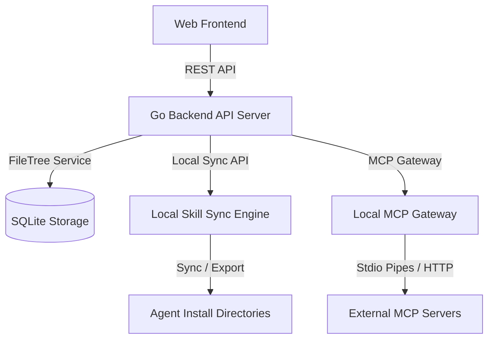

# Vola Project Architecture

This document describes the design and components of Vola.

## Overview

## Key Modules

1. **API Server (`internal/api`)**: Routes web requests, authenticates tokens, manages user profile/memory/projects/skills.
2. **FileTree Service (`internal/services`)**: Provides logical file tree storage on top of SQLite, ensuring access level validation and encryption candidates.
3. **Local Skill Sync Engine (`internal/api/local_skill_sync.go`)**: Manages the local directory matching, file write plans, cleanups, and export packages for various target platforms.
4. **MCP Gateway (`internal/mcp/gateway.go`)**: Process manager for stdio MCP connections, handling merge requests for tools.
